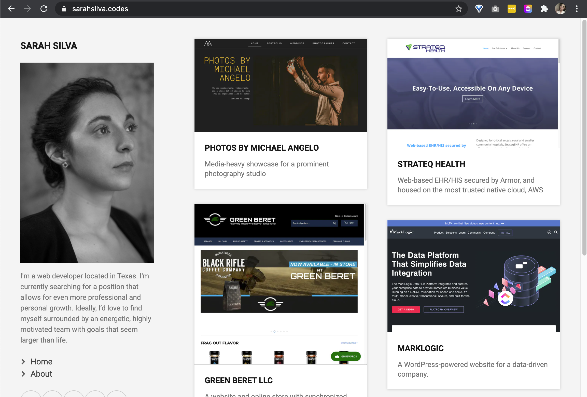

# Sarah's Gatsby Portfolio Website
See it live at https://sarahsilva.codes/

This repo contains a static website written with [GatsbyJS](https://www.gatsbyjs.org/), integrated with content coming from [DatoCMS](https://www.datocms.com).



If you want to use try this out yourself, you first need to set up a project on DatoCMS which will host your data.

You can [sign up for a free account](https://dashboard.datocms.com/signup) 


## Repo usage

First, install the dependencies of this project:

```
npm install
```

Add an `.env` file containing the read-only API token of your DatoCMS site:

```
echo 'DATO_API_TOKEN=abc123' >> .env
```

Then, to run this website in development mode (with live-reload):

```
npm run develop
```

To build the final, production ready static website:

```
npm run build
```

The final result will be saved in the `public` directory.


This websites uses:

- [GatsbyJS](https://github.com/gatsbyjs/gatsby) as website generator;
- [gatsby-source-datocms](https://github.com/datocms/gatsby-source-datocms) to integrate the website with DatoCMS.
